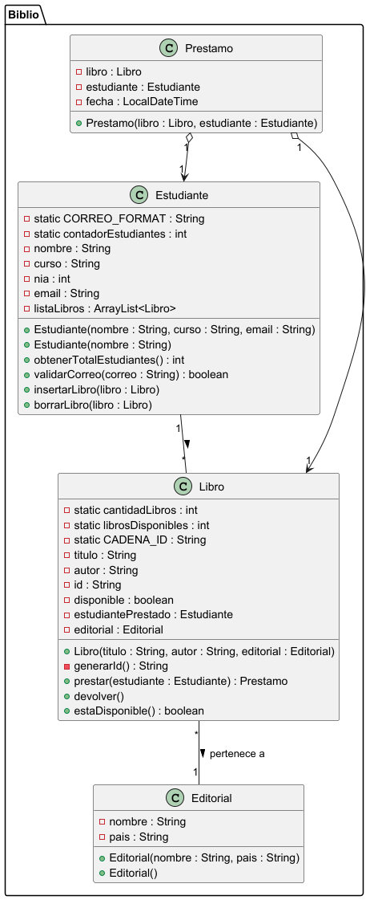

# Práctica 1. Práctica de compra-venta de casas 

## ÍNDICE 
1. [Intro](https://github.com/pbendom3/POO_DAM/edit/main/POO_1dam/src/main/java/inmobiliaria/practica1.md#1-intro)
2. [Estructura de clases](#2-estructura-de-clases)
   - Diagrama de clases UML
   - Código de PlantUML
   - Contenido de las clases (.java)
4. [Programa principal (InmobiliariaApp)](#3-programa-principal-inmobiliariaapp)
5. [Pruebas](#4-pruebas)
6. [Entrega](#5-entrega)

### 1. Intro
> La práctica consiste en una app ...

### 2. Estructura de clases

#### Diagrama de clases UML


#### Código de PlantUML

````
@startuml

package Biblio {

    class Estudiante {
        - static CORREO_FORMAT : String
        - static contadorEstudiantes : int
        - nombre : String
        - curso : String
        - nia : int
        - email : String
        - listaLibros : ArrayList<Libro>

        + Estudiante(nombre : String, curso : String, email : String)
        + Estudiante(nombre : String)
        + obtenerTotalEstudiantes() : int
        + validarCorreo(correo : String) : boolean
        + insertarLibro(libro : Libro)
        + borrarLibro(libro : Libro)
    }

    class Editorial {
        - nombre : String
        - pais : String

        + Editorial(nombre : String, pais : String)
        + Editorial()
    }

    class Libro {
        - static cantidadLibros : int
        - static librosDisponibles : int
        - static CADENA_ID : String
        - titulo : String
        - autor : String
        - id : String
        - disponible : boolean
        - estudiantePrestado : Estudiante
        - editorial : Editorial

        + Libro(titulo : String, autor : String, editorial : Editorial)
        - generarId() : String
        + prestar(estudiante : Estudiante) : Prestamo
        + devolver()
        + estaDisponible() : boolean
    }

    class Prestamo {
        - libro : Libro
        - estudiante : Estudiante
        - fecha : LocalDateTime

        + Prestamo(libro : Libro, estudiante : Estudiante)

    }

    ' Relaciones
    Estudiante "1" -- "*" Libro : >
    Libro "*" -- "1" Editorial : pertenece a >
    Prestamo "1" o--> "1" Libro
    Prestamo "1" o--> "1" Estudiante
}

@enduml

````

#### Contenido de las clases (.java)

   - Clase **Casa.java**:

````
package inmobiliaria;

import java.util.ArrayList;
import java.util.Scanner;

public class Casa {

    static Scanner teclado = new Scanner(System.in);

    private String direccion;
    private ArrayList<Habitacion> listaHabitaciones;
    private Propietario propietario;

    public Casa (String direccion){
        this.direccion=direccion;
        listaHabitaciones = new ArrayList<>();
        setPropietario();
    }

    public void crearHabitacion(String nombre, double metros){

        for (Habitacion habitacion : listaHabitaciones){
            if (habitacion.getNombre().equals(nombre)){
                System.out.println("La habitación " + nombre + " ya existe.");
                return;
            }
        }

        Habitacion habitacion = new Habitacion(nombre,metros);
        listaHabitaciones.add(habitacion);
        System.out.println("Habitación " + nombre + " creada.");

    }

    public void eliminarHabitaciones(String nombre){

        for (Habitacion habitacion : listaHabitaciones){
            if (habitacion.getNombre().equals(nombre)){
                listaHabitaciones.remove(habitacion);
                System.out.println("Habitación " + nombre + " borrada con éxito.");
                return;
            }
        }

        System.out.println("La habitación " + nombre + " no existe.");

    }

    public void mostrarHabitaciones(){

        System.out.println("Casa en " + direccion + " y propietario " + propietario.getNombre() + " tiene " + listaHabitaciones.size() + " habitaciones:");
        for (Habitacion habitacion : listaHabitaciones){
            System.out.println("- " + habitacion.getNombre() + " (" + habitacion.getMetros() + ") m2");
        }

    }

    public Habitacion getHabitacionMasGrande(){

        Habitacion mayor = listaHabitaciones.get(0);

        for(Habitacion habitacion : listaHabitaciones){
            if (habitacion.getMetros()>mayor.getMetros()){
                mayor=habitacion;
            }
        }

        return mayor;

    }

    public Propietario getPropietario() {
        return propietario;
    }

    public void setPropietario() {
        System.out.println("Introduce el nombre del propietario de la casa en " + direccion);
        String nombre = teclado.next();
        teclado.nextLine();
        System.out.println("Edad: ");
        int edad = teclado.nextInt();
        teclado.nextLine();
        Propietario propietario = new Propietario(nombre,edad);
        this.propietario = propietario;
        System.out.println("Propietario " + nombre + " añadido.");
    }

    public ArrayList<Habitacion> getListaHabitaciones() {
        return listaHabitaciones;
    }

    public void setListaHabitaciones(ArrayList<Habitacion> listaHabitaciones) {
        this.listaHabitaciones = listaHabitaciones;
    }

    public String getDireccion() {
        return direccion;
    }

    public void setDireccion(String direccion) {
        this.direccion = direccion;
    }

    @Override
    public String toString() {
        return "Casa{" +
                "direccion='" + direccion + '\'' +
                "propietario=" + propietario +
                '}';
    }

}

````

[Link a la clase Casa en *GitHub*](https://github.com/pbendom3/POO_DAM/blob/main/POO_1dam/src/main/java/inmobiliaria/Casa.java)

### 3. Programa principal (InmobiliariaApp)

> [!NOTE]
> Useful information that users should know, even when skimming content.

> [!TIP]
> Helpful advice for doing things better or more easily.

> [!IMPORTANT]
> Key information users need to know to achieve their goal.

> [!WARNING]
> Urgent info that needs immediate user attention to avoid problems.

> [!CAUTION]
> Advises about risks or negative outcomes of certain actions.

### 4. Pruebas

### 5. Entrega

- [X] Código fuente en GitHub: [Link]()
- [ ] Documentación
- [ ] Pruebas  
